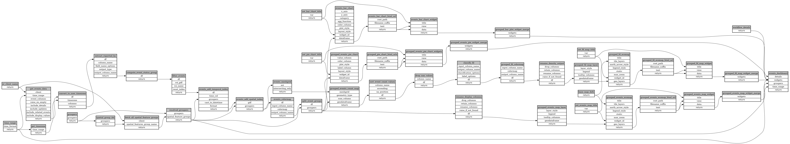

```
# AUTOGENERATED BY ECOSCOPE-WORKFLOWS; see fingerprint in README.md for details

```

```yaml
# fingerprint:
artifacts_sha256_basic: 237ed3204ab39475f8916371eeb06288280eb3a407baa04895bcf85ab22e5afb
artifacts_sha256_strict: e8f0700119d303dcfae1ae60a2eacbbf6e48b5d8d20566480cd8b51d1b870f69
installed_requirements:
- channel: https://repo.prefix.dev/ecoscope-workflows/
  name: ecoscope-platform
  version: {version: ==2.13.0}
- channel: conda-forge
  name: pydeck
  version: {version: ==0.9.2}
params_sha256: ec545e7d6035abd6497698227b88976165735c36a6ab9bbb3f90fb3eab22ca5d
spec_sha256: f3d5ad8cac35a26786fbfb621a51240df52f299b228644f20698488ed7a4e1ed

```

# wt-custom-events-workflow


